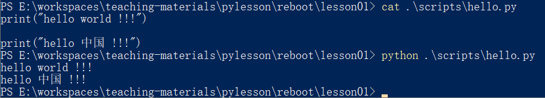

<!-- markdown-toc start - Don't edit this section. Run M-x markdown-toc-refresh-toc -->
**Table of Contents**

- [* 大纲](#-大纲)
- [* 课程介绍](#-课程介绍)
- [一、 Python介绍](#一-python介绍)
    - [-](#-)
    - [* Python特点](#-python特点)
    - [* Python生态系统](#-python生态系统)
    - [* Python应用场景](#-python应用场景)
- [二、 准备环境](#二-准备环境)
- [三、 第一个Python程序](#三-第一个python程序)
- [四、 变量](#四-变量)
- [五、 接收命令行语句](#五-接收命令行语句)
- [六、 注释](#六-注释)
- [七、 数据类型](#七-数据类型)
- [八、 布尔类型运算](#八-布尔类型运算)
- [九、 类型判断 与 转换](#九-类型判断-与-转换)
- [十、 流程控制](#十-流程控制)
- [十一、 循环](#十一-循环)
- [十二、 练习](#十二-练习)
- [十三、 作业](#十三-作业)
- [* Q&A](#-qa)

<!-- markdown-toc end -->

# * 大纲 #

- 课程介绍
- 学习目标
- Python介绍
- 准备环境
- 第一个Python程序
- 变量
- 注释
- 数据类型
- 流程控制
- 循环
- Q&A


# * 课程介绍 #
总体大纲


# 一、 Python介绍 #
  - Python是什么
  - Python特点
  - Python生态系统
  - Python应用场景

### * Python 是什么 ###
  - Python(蟒蛇) 是一种解释性、编译性、和面向对象的脚本语言。
  - Python 由 Guido van Rossum (吉多·范罗苏姆) 于 1989 年底在荷兰国家数学和计算机科学研究所发明，第一个公开发行版发行于 1991 年。

  

### * Python特点 ###
  - 易于学习
  - 易于阅读
  - 易于维护
  - 强大的标准库
  - 面向对象
  - 可移植、可扩展、可嵌入

### * Python生态系统 ###

  - 社区
  1. [pypi](http://pypi.python.org/ "pypi") ，                    网址： http://pypi.python.org/
  2. [github](http://github.com/ "github")，                      网址:http://github.com/
  3. [stackoverflow](https://stackoverflow.com "stackoverflow")， 网址： https://stackoverflow.com
  4. irc

- 成功案例
	> 国内：豆瓣、知乎、BAT、新浪、网易 ...
	> 国外：谷歌、YouTube、Facebook...
	> 黑洞照片处理程序

### * Python应用场景 ###
- **Web开发**
    * Flask
    * Django
    * Tornado
    * web2py

- **云计算**
    * OpenStack

- **科学计算**
    * numpy

- **系统管理工具**
    * Ansible
    * Saltstack

- **爬虫**
    * Scrapy


# 二、 准备环境 #
- 操作系统   ：CentOS 6.x | Mac os | windows
- Python版本 ：3.7.4
- IDE开发工具： PyCharm | eclipse + pydev | emacs | vim

注意：安装成功检测，输出，python, 出现 ```>>>```，提示符，说明成功。
     windows 安装需要添加环境变量，
     退出：linux: ctrl+D , windows: ctrl+Z


# 三、 第一个Python程序 #
- **环境**
   1. 交互式环境(使用场景 python)
   2. 脚本方式

- **四则运算**
    1. 加(+)、减(-)、乘(*)、除(/)、整除(//)、余(%)、幂(**)

- **备注**
    1. print 为Python的函数指令，用于让计算机打印括号中的内容。
    2. exit(Ctrl + D)  为python交互式环境下的函数指令，用于退出交互式环境。

* **示例1** - 输出
   1. 从控制台输出：
   

   2. 从文件输出：
   

* **示例2** - 四则运算
   


# 四、 变量 #
- 变量命名规则
    - 只能由大小写英文字母、数字、下划线组成
    - 不能以数字开头
    - 避免和python保留字和关键字冲突
- 变量名必须先定义在使用

- 示例1 - 变量
   * 代码： scripts/var.py
    ```python
    name = "hello world !!!"
    print(name)

    num1 = 2
    num2 = 3
    print( num1 + num2)
    print( num1 - num2)
    print( num1 * num2)
    print( num1 / num2)
    print( num1 % num2)
    ```
   * 输出：
   


# 五、 接收命令行语句 #
- **input函数**

- **示例**
  * 代码： scripts/input.py
    ```python
    num1 = input("Please input num1: ")
    num2 = input("Please input num2: ")

    print("num1: ", num1)
    print("num2: ", num2)
    ```
  - 输出：
    

- **练习**
    * 输入6个数字(整型)
        1. 求合计


# 六、 注释 #
- 单行注释
- 多行注释


# 七、 数据类型 #
- 整数 (int)
    * 年龄、分数
- 浮点数 (float)
    * 身高、圆周率
- 字符串 (str)
    * 一句话、一段话
- 布尔类型 bool
    * 表示真假、只有True 和 False两个值。


# 八、 布尔类型运算 #
- **布尔运算**

	1. 或 (A or B：A、B两个只要一个为真则为真)
	2. 且 (A and B：A、B两个都为真时才为真
	3. 非 (not A： A为真则为假，A为假则为真)

- **示例**

   * 代码： scripts/value.py
    ``` python
    age = 18
    score = 91

    height = 1.78
    pi = 3.1415926

    var1 = "reboot python19."
    var2 = 'reboot python19.'
    var3 = '''
    reboot python19.
    '''
    var4 = '''
    reboot python19.
    '''

    ok = True
    err = False
    is_boy = True
    is_girl = False
    ```

# 九、 类型判断 与 转换 #
- **type函数**


- **类型转换**
   int <--> str <--> float <--> int


# 十、 流程控制 #
- **分支语句**
    * 代码规则： scripts/if3.py
    ```  python
    if 表达式1:
        语句
    elif 表达式2:
        语句
    elif 表达式3:
        语句
    elif 表达式4:
        语句
    ...
    else:
        语句
    ```

  * 注意

	1. 每个条件后面要使用冒号 :，表示接下来是满足条件后要执行的语句块。
	2. 使用缩进来划分语句块，相同缩进数的语句在一起组成一个语句块。
	3. 在 Python 中没有 switch - case 语句。


- **练习**

  * 练习 - 1
    + 输入：用户名，性别、年龄;
    + 输出：你好XXX先生(女士)，您的年龄低于(高于)18岁，(不)可以进入

  * 输入分数，评等级，条件：
    1. 如果分数>= 90, 评分是A.
    2. 如果分数>= 80, 小于90, 评分是B.
    3. 如果分数>= 70, 小于80, 评分是C.
    4. 如果分数>= 60, 小于70, 评分是D.
    5. 如果分数<  60, 评分是E.
    + 输出：your score is <80>, get <B\>\.


# 十一、 循环  #
- **for循环**
  * 代码规则：
    ```python
  for <循环变量> in <循环对象>： <语句1>
  else : <语句2>
    ```

  注意：else 分支语句可以省略

  * 示例一
    ```python

    s = '1234567890-'

    for x in s:
        print(x)
    ```

  * 示例二
    ```
    s = '1234567890-'

    for x in s:
        print(x)
    else:
        print("finished")
    ```

- ** while循环 **

  * 代码规则：
    ```python
    while <条件>：
        <语句1>
    else:
        <语句2>
    ```
    注意：else 分支语句可以省略

  * 示例一
   ```python
    total = 0
    num = 1
    while num <= 10:
        num = num + 1
        total = total + num

    print(total)
    ```
  * 示例二
    ```python

    total = 0
    num = 1
    while num <= 10:
        print(num)
        total = num + 1
    else:
        print(total)
    ```

- **控制循环**
    - break 跳出整个循环
    - continue 终止本次循环，进入下一次循环
    - pass 空语句 是为了保持程序结构的完整性。pass 不做任何事情，一般用做占位语句。

  * 示例一
    ```python
    # not exec else
    var = [1, 2, 3, 4, 5, 6, 7, 8, 9, 0 ]
    for x in var:
        print(x)
        if x == 0:
            print('in if x== 0 will not execute else case')
            break
    else:
        print("else case executed , finished")
    ```

   * 示例二
    ```python

    total = 0
    num = 1
    while num <= 10:
        num = num + 1
        total = total + num

        if (total > 50):
            print("total: bigger then 50 , current total: ", total)
            break
    else:
        print(total)
    ```


# 十二、 练习 #
- 输入6个数字(整型)
    1.求合计

- 计算1到100的和
	1. 打印结果

- 输入多个数字(整型),直到输入0结束
	1.求合计
	2.求最大值


# 十三、 作业 #

- **打印乘法口诀**

   * 提示：尝试print(‘monkey’)与print('monkey', end='')的区别


- 猜数游戏
  * 条件：
      1. 猜一个100以内的整数
      2. 6次机会
      3. 每次猜时，猜对了，大了，小了

  * 提示：生成随机数的方法
    ``` python
    import random
    random.randint(0, 100)
    ```


# * Q&A #
<!--  -->

 - taniey by [[https://www.51reboot.com/][51reboot]]
 - github: http://github.com/taniey
 - 邮箱： taniey@live.cn
