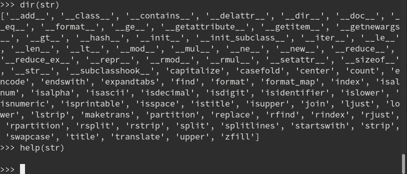

<!-- markdown-toc start - Don't edit this section. Run M-x markdown-toc-refresh-toc -->
**Table of Contents**

- [一、 上节回顾](#一-上节回顾)
- [二、 字符串](#二-字符串)
    - [-](#-)
    - [* 操作](#-操作)
    - [* 访问](#-访问)
    - [* 修改](#-修改)
    - [* 遍历](#-遍历)
    - [* 函数](#-函数)
    - [* 运算](#-运算)
    - [* 方法](#-方法)
- [三、 pip3](#三-pip3)
- [四、 列表](#四-列表)
    - [-](#--1)
    - [* List操作](#-list操作)
    - [* List函数](#-list函数)
    - [* 练习](#-练习)
- [五、 元组](#五-元组)
    - [-](#--2)
- [六、 作业](#六-作业)

<!-- markdown-toc end -->

# 一、 上节回顾 #

- 变量
- 接收命令行语句
- 注释
- 数据类型
- 布尔类型运算
- 类型判断-与-转换
- 流程控制
- 循环
- 作业
   - 打印乘法口诀
   - 猜数游戏

# 二、 字符串 #


### * 定义 ###


- 使用单引号、双引号、三个单引号或三个双引号引起来的一些字符
```python
name = 'monkey'
desc = '51reboot python lesson2'
text = '''
        this is the three quote case.
       '''
```
- 特殊字符
   + 反斜杠 (\\) 用来对特殊含义的字符进行转义，例如换行，反斜杠本身或是引号等字符。
- 前缀
   + 包括，
      * 字符串： r, u, R, U, f, F, fr, Fr, fR, FR, rf, rF, Rf, RF
      * 字节串： b, B, br, Br, bR, BR, rb, Rb, rB, RB

   + 字符串和字节串字面值都可以带有前缀 'r' 或 'R'；这种字符串被称为 原始字符串 其中的反斜杠会被当作其本身的字面字符来处理
   + 字节串字面值总是带有前缀 'b' 或 'B'；它们生成 bytes 类型而非 str 类型的实例。它们只能包含 ASCII 字符；字节对应数值在128及以上必须以转义形式来表示。
   + 字符串和字节串字面值都可以带有前缀 'r' 或 'R'；这种字符串被称为 原始字符串 其中的反斜杠会被当作其本身的字面字符来处理。因此在原始字符串字面值中，'\U' 和 '\u' 转义形式不会被特殊对待。
   + 包含 'f' 或 'F' 前缀的字符串字面值称为 格式化字符串字面值；
   + 'f' 可与 'r' 连用，但不能与 'b' 或 'u' 连用，因此存在原始格式化字符串，但不存在格式化字节串字面值。
   + 在三引号字面值中，允许存在未经转义的换行和引号 (并原样保留)，除非是未经转义的连续三引号，这标示着字面值的结束。 ("引号" 是用来标示字面值的字符，即 ' 或 "。)

- 格式化字符串

<!--
### * 操作 ###

- 访问
- 修改
- 遍历
- 函数
- 运算
- 方法
-->

### * 访问 ###
- 单元素访问
```
>>> desc = '51reboot python 22'
>>> desc[0]
'5'
>>> desc[1]
'1'
>>> desc[-1]
'9'
>>> desc[100]
Traceback (most recent call last):
  File "<stdin>", line 1, in <module>
IndexError: string index out of range

```

- 结论：
    1. 字符串是有序的数据集
    2. 通过索引方式访问字符串
    3. 索引编号
       + 从左往右依次为：0, 1, 2, 3, ..., n-1
       + 从右往左依次为：-1, -2, -3, ..., -n
    4. 访问元素的索引必须存在，否则报错
    5. 索引取值范围？

### * 修改 ###
```
>>> desc = '51reboot python19'
>>> desc[0] = 9
Traceback (most recent call last):
  File "<stdin>", line 1, in <module>
TypeError: 'str' object does not support item assignment
```

- 结论：
   1. 字符串不能修改


### * 遍历 ###
```python
desc = '51reboot python'

for x in desc:
    print(x)
```

### * 函数 ###
```python

s = '5389721'

print(len(s))

print(max(s), min(s))

print('2' in s)

print('hello' in s)

```

### * 运算 ###

```python

s1 = 'beijing' + ' ' + 'python19' + ' ' + 'monkey'
print(s1)

s2 = '-----' * 10
print(s2)

```

### * 方法 ###

方法快速查看，及本地帮助


# 三、 pip3 #

    - pip3 install ipython

- str.method -> list


* 示例
.background imgs/bg.png

* 练习
.background imgs/bg.png

- 查找字符串'abcdefabc'中第二个ab的位置
	提示: help(str.find)


# 四、 列表 #

.background imgs/bg.png

- 定义
- 操作
- 函数
- 解析式


### * List定义 ###

.background imgs/bg.png

- list是处理一组`有序`项目的数据结构，即你可以在一个列表中存储一个序列的项目
- 列表是可变类型的数据
- 列表的组成：用[]表示列表，包含了多个以逗号分隔开的数字或字符串

* 示例
.background imgs/bg.png

.code -edit scripts/list01.py

- 注意：
	1. 使用中括号包含
	2. 每个元素之间使用逗号分隔
	3. 可包含任意数据类型


### * List操作 ###

.background imgs/bg.png
	取值
		切片和索引
		list[]
	添加
		list.append()
		list.insert()
	删除
		del(list)
		list.remove(list[])
		list.pop()
	修改
		list[] = x
	查找
		var in list
	统计
		list.count()
	排序
		list.sort()
		list.reverse
		sorted()
	遍历
		for . in .


### * List函数 ###

.background imgs/bg.png

- len(list)
- max(list)
- min(list)
- list(seq)


* 示例
.background imgs/bg.png


### * 练习 ###

.background imgs/bg.png

- 打印列表中的最大数字
	- [5, 12, 32, 4, 2, 10, 25]


- 移动列表的最大数字到最后
	- 原始列表：[5, 12, 32, 4, 2, 10, 25]
	- 最终列表：[5, 12, 4, 2, 10, 25，32]

	提示：
	a = 1
	b = 2
	a, b = b, a

- 求两个列表中重复的元素的列表
	- [1, 2, 5, 7, 11]
	- [2, 15, 3, 7]


# 五、 元组 #

- 元组的定义
- 元组的操作
- 元组的应用


### * 元组的定义 ###

- 元组和列表十分类似，只不过元组和字符串一样是不可变的 即你不能修改元组
	元组通过()圆括号中用,逗号分割的项目定义
	元组通常用在使语句或用户定义的函数能够安全地采用一组值的时候，即被使用元组的值不会改变。

- 可以存储一系列值、存储安全性比较高的、不可改变的

- 元组的操作
	元组和字符串类型一样属于序列类型，可通过索引和切片操作
	元组值亦不可变


# 六、 作业 #

- 字符串和列表的方法写中文文档及示例

- 用户管理系统
    1. 登录认证；
    2. 增删改查和搜索
        3.1 增 add
        3.2 删 delete
        3.3 改 update
        3.4 查 list
        3.5 搜 find
    3. 格式化输出

- 冒泡排序
	- [3, 7, 2, 5, 20, 11]


* Q&A
.background imgs/bg.png

.image imgs/qa.png

.caption _taniey_ by [[https://www.51reboot.com/][51reboot]]
